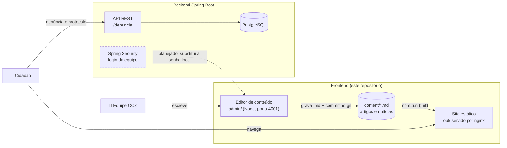

# Portal CCZ Mossoró

Portal institucional do **Centro de Controle de Zoonoses de Mossoró**, da Vigilância em Saúde.

Site **100% estático** (Next.js com `output: "export"`), otimizado para SEO. Roda em qualquer
hospedagem, sem servidor Node. O conteúdo é escrito num editor próprio e o serviço de denúncias
conversa com um backend Spring Boot.

## Como funciona



Duas coisas importantes nesse desenho:

- **O site não depende do editor nem do backend para ficar no ar.** Se os dois caírem, as páginas
  continuam servidas normalmente, porque são HTML pronto.
- **Publicar não atualiza o site sozinho.** O editor grava o `.md` e commita; o site só muda
  depois de um `npm run build`.

## Rodando

```bash
npm install
npm run dev      # site em http://localhost:3000
npm run build    # gera o site estático em ./out
npm run lint
npm test         # testes unitários do front e do contrato do editor
```

Para configurar o front local, copie `.env.example` para `.env.local`. Use
`NEXT_PUBLIC_SIMULATE=1` apenas para demonstrar o formulário sem uma API real.

Editor de conteúdo (app separado, precisa de servidor Node):

```bash
cd admin
npm install
npm run dev      # editor em http://localhost:4001
```

O admin é um editor demonstrativo local: ele grava Markdown e imagens no repositório e cria
commits para manter o histórico. Ele ainda não publica sozinho nem substitui a integração com o
backend; depois de revisar uma alteração, rode `npm run build` no front para gerar o site estático.
Defina `ADMIN_PASSWORD` e `ADMIN_SESSION_SECRET` no `admin/.env.local` usando
[`admin/.env.example`](admin/.env.example).

Tudo junto com o backend e o banco:

```bash
docker compose up --build   # site :4000, API :8080, Postgres :5432
```

> O compose espera o backend clonado como pasta irmã (`../SiteInstitucionalCCZ-BackEnd`).
> Só o site: `docker compose up --build frontend`.

## Estrutura

```
src/
  app/          rotas: page.tsx, services/, news/, articles/, reports/
                about/, contact/, accessibility/, privacy/
                sitemap.ts, robots.ts, manifest.ts
  components/   layout, home, cards, forms, maps, ui, widgets
  lib/
    site.ts     ⚙️ dados institucionais (contato, endereço, domínio)
    cms/        leitura dos .md de content/
    api.ts      🔌 integração com o backend Spring
    seo.ts      metadata + JSON-LD
content/
  articles/     artigos de educação em saúde
  news/         campanhas, mutirões e avisos
admin/          editor de conteúdo (app Next.js separado)
public/img/     imagens e ilustrações
docs/           CONTEUDO.md, guia de quem escreve
```

## Conteúdo

Artigos e notícias são arquivos Markdown em `content/`, com um cabeçalho de metadados.
O campo `draft` decide se aparece no site: `true` fica só no editor, `false` vai ao ar.

Detalhes em [docs/CONTEUDO.md](docs/CONTEUDO.md).

## Backend Spring

Toda a comunicação está isolada em [`src/lib/api.ts`](src/lib/api.ts). Nenhum componente de UI
chama a API direto.

| Ação | Endpoint |
| --- | --- |
| Enviar denúncia (multipart, com foto) | `POST /denuncia` |
| Consultar protocolo | `GET /denuncia/{id}` |

Variáveis de ambiente no build:

| Variável | Para que serve |
| --- | --- |
| `NEXT_PUBLIC_API_URL` | Endereço da API. Ex.: `http://localhost:8080` |
| `NEXT_PUBLIC_SIMULATE` | `1` gera protocolo falso no navegador, sem backend. Útil para demonstrar a UI. |

## Login da equipe

Hoje o editor usa uma **senha única** na variável `ADMIN_PASSWORD` (veja
[`admin/.env.example`](admin/.env.example)). É provisório: sem essa variável, ninguém entra.

O plano é substituir por **Spring Security**, no mesmo backend das denúncias. Assim a equipe
passa a ter usuários individuais e o histórico do git mostra quem publicou o quê.

## Acessibilidade e SEO

Conformidade-alvo **eMAG** e **WCAG 2.1 AA**, obrigatórias para portais públicos: navegação por
teclado, foco visível, "pular para o conteúdo", HTML semântico, VLibras e barra de contraste.
No SEO, HTML pré-renderizado, metadata por página, `sitemap.xml`, `robots.txt` e JSON-LD de
`GovernmentOrganization`, `WebSite` e `BreadcrumbList`.
